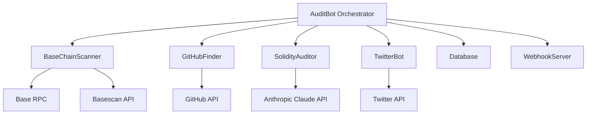
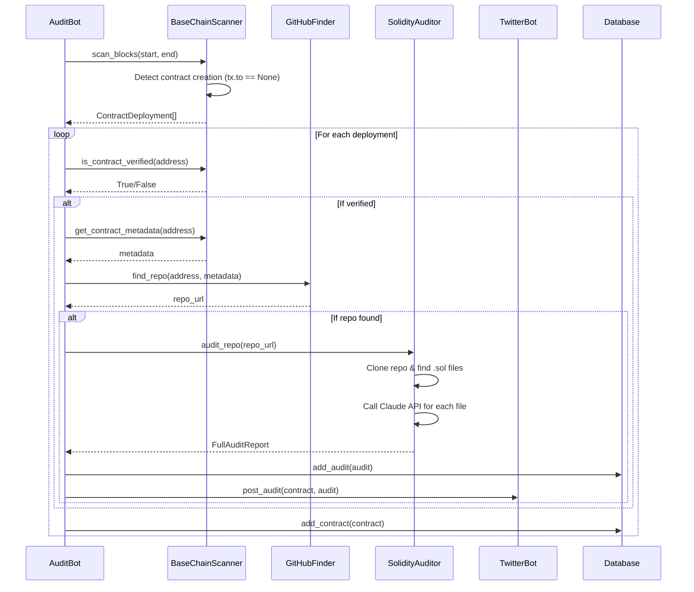

## Overview

Base Audit Bot is a modular, automated smart contract auditing system that continuously monitors the Base blockchain for new contract deployments, performs AI-powered security audits using Claude, and publishes findings to Twitter.

## System Components

The bot consists of six main components that work together:



### 1. AuditBot Orchestrator

The central coordinator that manages the entire audit workflow. Located in `bot.py`:

```python
class AuditBot:
    """Main bot orchestrator."""

    def __init__(self, config: Config):
        # Initialize all components
        self.db = Database(config.database_path)
        self.scanner = BaseChainScanner(...)
        self.github_finder = GitHubFinder(...)
        self.auditor = SolidityAuditor(...)
        self.twitter_bot = TwitterBot(...)
```

**Key Responsibilities:**
- Manages the main scan cycle loop
- Coordinates component interactions
- Handles error recovery and retry logic
- Processes contract deployments end-to-end
- Manages DM commands and daily summaries

### 2. BaseChainScanner

Monitors the Base blockchain for new contract deployments using Web3.py:

```python
class BaseChainScanner:
    def __init__(self, rpc_url: str, basescan_api_key: str, min_contract_size: int = 100):
        self.w3 = Web3(Web3.HTTPProvider(rpc_url))
        self.basescan_api_key = basescan_api_key
```

See [Blockchain Monitoring](/concepts/blockchain-monitoring) for detailed implementation.

### 3. GitHubFinder

Discovery engine for finding GitHub repositories associated with deployed contracts:

```python
class GitHubFinder:
    def find_repo(self, contract_address: str, metadata: Optional[dict] = None) -> Optional[str]:
        # Multi-strategy search: source code, metadata, GitHub search
```

See [GitHub Discovery](/concepts/github-discovery) for detailed strategies.

### 4. SolidityAuditor

AI-powered security auditor using Anthropic's Claude model:

```python
class SolidityAuditor:
    AUDIT_PROMPT = """You are an expert smart contract security auditor..."""

    def __init__(self, anthropic_api_key: str, temp_dir: Optional[Path] = None):
        self.client = anthropic.Anthropic(api_key=anthropic_api_key)
```

See [AI-Powered Auditing](/concepts/ai-auditing) for Claude integration details.

### 5. TwitterBot

Social media integration for posting audit results and monitoring commands:

```python
class TwitterBot:
    def __init__(self, credentials: TwitterCredentials):
        # OAuth 1.0a for posting tweets
        self.api = tweepy.API(self.auth, wait_on_rate_limit=True)
        # OAuth 2.0 for v2 endpoints
        self.client = tweepy.Client(...)
```

See [Twitter Integration](/concepts/twitter-integration) for posting workflows.

### 6. Database

SQLite-based persistence layer for storing contracts, audits, tweets, and configuration.

## Data Flow

### Contract Discovery and Audit Flow



### Scan Cycle

The bot runs in a continuous loop with configurable intervals:

```python
def run(self):
    """Main bot loop."""
    self.running = True
    
    while self.running:
        try:
            self._run_cycle()
        except Exception as e:
            logger.error(f"Error in main loop: {e}", exc_info=True)
        
        # Wait for next cycle
        if self.running:
            time.sleep(self.config.scan_interval_minutes * 60)
```

Each cycle:
1. **Scans blocks** for new contract deployments
2. **Processes each deployment** (verify, find repo, audit)
3. **Checks DM commands** for manual audit requests
4. **Posts daily summaries** at midnight UTC

## Configuration Management

All components are configured through environment variables loaded via a `Config` dataclass:

```python
config = get_config()  # Loads from .env file

bot = AuditBot(config)
bot.run()
```

**Key Configuration:**
- `BASE_RPC_URL` - Base blockchain RPC endpoint
- `BASESCAN_API_KEY` - Basescan API access
- `ANTHROPIC_API_KEY` - Claude API access
- `TWITTER_*` - Twitter OAuth credentials
- `SCAN_INTERVAL_MINUTES` - Scan frequency (default: 15)
- `BLOCKS_TO_SCAN` - Initial block range (default: 100)

## Error Handling and Resilience

### Retry Logic

All external API calls implement exponential backoff:

```python
def _retry_on_failure(self, func, *args, **kwargs):
    """Execute function with retry logic."""
    for attempt in range(self.max_retries):
        try:
            return func(*args, **kwargs)
        except Exception as e:
            if attempt < self.max_retries - 1:
                delay = self.retry_delay * (2 ** attempt)  # Exponential backoff
                time.sleep(delay)
```

### Component Isolation

Each component is designed to fail independently without crashing the entire bot:

```python
for deployment in deployments:
    try:
        self._process_deployment(deployment)
    except Exception as e:
        logger.error(f"Error processing deployment {deployment.address}: {e}")
        # Continue with next deployment
```

### Rate Limiting

- **Basescan API**: Built-in rate limit handling
- **Claude API**: Automatic retry on rate limits with 60s delay
- **GitHub API**: 200ms delay between requests
- **Twitter API**: `wait_on_rate_limit=True` in Tweepy clients

## Webhook Integration

Optional webhook server for manual triggers and monitoring:

```python
if config.webhook_secret:
    self.webhook_server = create_webhook_handler(
        db=self.db,
        twitter_bot=self.twitter_bot,
        auditor=self.auditor,
        webhook_secret=config.webhook_secret,
        port=config.webhook_port
    )
    self.webhook_server.start(threaded=True)
```

## Performance Characteristics

### Throughput

- **Block scanning**: ~100 blocks per cycle (configurable)
- **Audit speed**: ~2-5 seconds per Solidity file (Claude API latency)
- **Cycle time**: Typically 1-3 minutes depending on deployments found

### Resource Usage

- **Memory**: ~50-100 MB base + temporary repo clones
- **Storage**: SQLite database grows ~1 KB per contract
- **Network**: Moderate (RPC, Basescan, GitHub, Claude, Twitter APIs)

## Deployment Architecture

The bot is designed to run as a single long-running process:

```bash
# Run directly
python bot.py

# Or as a systemd service
systemctl start base-audit-bot
```

**Recommended deployment:**
- VPS or cloud instance with persistent storage
- Reliable network connection
- Log rotation for `logs/bot.log`
- Monitoring for process health

## Extensibility Points

The modular architecture allows easy extension:

1. **Custom scanners** - Implement different blockchain monitoring strategies
2. **Additional auditors** - Integrate other security analysis tools
3. **Alternative outputs** - Add Discord, Telegram, or webhook notifications
4. **Enhanced discovery** - Extend GitHub finder with additional strategies
5. **Database adapters** - Support PostgreSQL or other databases

## Next Steps

<CardGroup cols={2}>
  <Card title="Blockchain Monitoring" icon="link" href="/concepts/blockchain-monitoring">
    Learn how the scanner detects contract deployments
  </Card>
  <Card title="AI-Powered Auditing" icon="brain" href="/concepts/ai-auditing">
    Understand Claude integration and audit prompts
  </Card>
  <Card title="GitHub Discovery" icon="github" href="/concepts/github-discovery">
    Explore multi-strategy repository discovery
  </Card>
  <Card title="Twitter Integration" icon="twitter" href="/concepts/twitter-integration">
    See how audit results are published
  </Card>
</CardGroup>